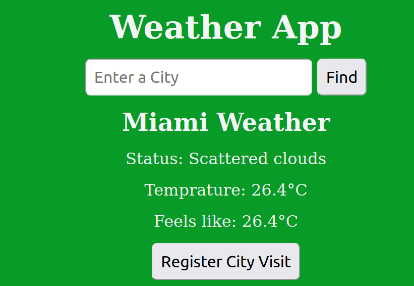

# Weather App

The Weather App is a simple web application that allows users to check real-time weather information for any location around the world. It provides temperature, status, and feels like  weather conditions for a selected city. This `README.md` file provides information about the app, its features, and how to set it up and use it.

## Features

- **Get Weather**: Enter the name of a city, and the app will retrieve and display the current weather conditions for that location.
- **User Registration**: Sign up and create an account to access personalized features and settings.
- **Responsive Design**: The app is designed to work on various screen sizes, ensuring a consistent user experience on different devices.
- **Data Storage**: City and user data are stored in an Json and SQLite3 database for efficient data management.

## Usage

To use the Weather App, follow these steps:

1. **Clone the Repository**:
  
   git clone https://github.com/codewithdani/weather-app.git
   - cd weather-app

## Install Dependencies
pip install -r requirements.txt

## Run the App
python server.py

## Access the App
Open a web browser and go to http://localhost:8000 to use the app.

## Technologies Used
- **Python**
- **Flask (Web Framework)**
- **SQLite3 (Database)**
- **JSON**
- **HTML and CSS**

## License
This project is licensed under the MIT License.

# Contributor
Daniel Giday

# Contact
If you have any questions or feedback, please contact daneximpex@gmail.com
